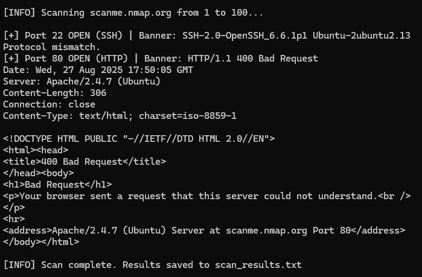

## 🔗 Try it Online
[](https://replit.com/@Giuseppe552/NetworkScanner)


# 🕵️‍♂️ Python Network Scanner  


███████╗ █████╗ ███╗ ██╗███╗ ██╗███████╗
██╔════╝██╔══██╗████╗ ██║████╗ ██║██╔════╝
███████╗███████║██╔██╗ ██║██╔██╗ ██║█████╗
╚════██║██╔══██║██║╚██╗██║██║╚██╗██║██╔══╝
███████║██║ ██║██║ ╚████║██║ ╚████║███████╗
╚══════╝╚═╝ ╚═╝╚═╝ ╚═══╝╚═╝ ╚═══╝╚══════╝


A lightweight **multi-threaded port scanner** written in Python.  
Similar to a mini-Nmap, this tool scans open ports, detects common services, and grabs banners for additional information.  

---

## 📛 Badges  
  
  
  


---

## 🚀 Features  
- 🚩 Scan target IP/hostname across a port range  
- ⚡ Multi-threaded scanning (fast)  
- 🔍 Detects common services (HTTP, SSH, MySQL, etc.)  
- 🛰️ Banner grabbing for service details  
- 🗂️ Saves results to `scan_results.txt`  

---

## ⚙️ Usage  
```bash
python scanner.py -t scanme.nmap.org -p 1-100
````

Example output:

```
[+] Port 22 OPEN (SSH)
[+] Port 80 OPEN (HTTP)
[+] Port 443 OPEN (HTTPS) | Banner: Apache/2.4.41 (Ubuntu)

[INFO] Scan complete. Results saved to scan_results.txt
```

---

## 📸 Demo Screenshot

Here’s the scanner in action against **scanme.nmap.org** (safe test server provided by Nmap):



---

## 📂 Project Structure

```
network-scanner/
│── scanner.py       # main script
│── README.md        # documentation
│── scan_results.txt # generated results (after run)
│── screenshot.png   # demo screenshot
```


---

## 🚀 Getting Started
```bash
git clone https://github.com/Giuseppe552/network-scanner.git
cd network-scanner
python scanner.py -t scanme.nmap.org -p 1-100
```

---

## 🛠️ Roadmap
- [ ] Add UDP scanning
- [ ] Export results as JSON
- [ ] Add stealth mode (SYN scan)


---

## 🧑‍💻 Author

**Giuseppe** – Mathematics Graduate & aspiring Security Engineer

* GitHub: [@Giuseppe552](https://github.com/Giuseppe552)


⚠️ Disclaimer: This tool is for educational purposes only.  
Do not use it on networks without permission.  


```

