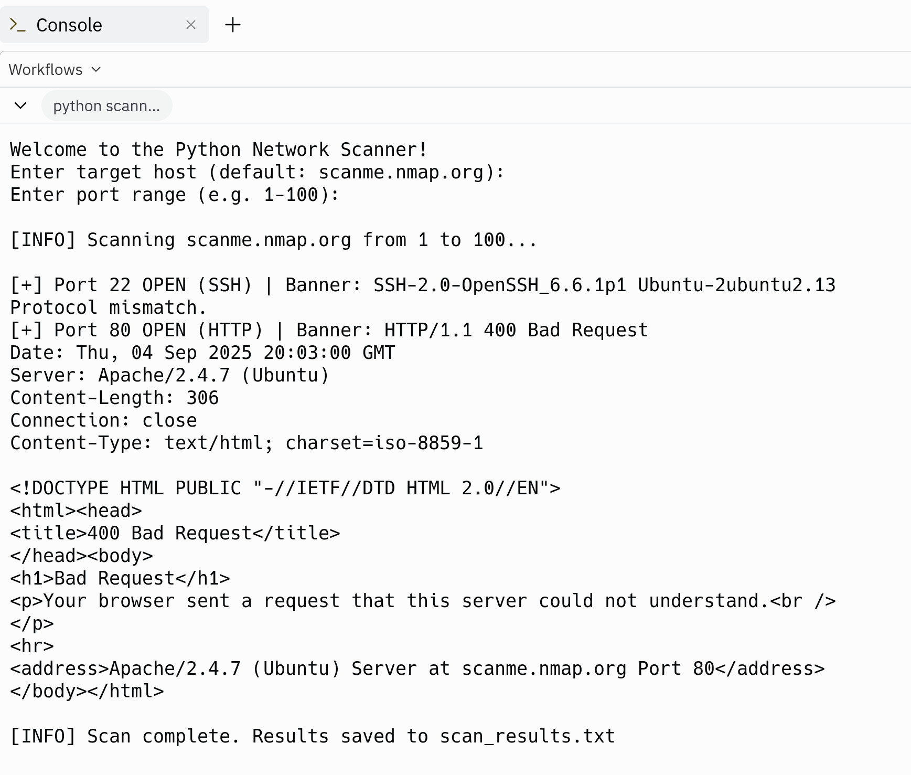

---

# 🕵️‍♂️ Python Network Scanner

> A fast, multi-threaded port scanner built in Python.
> Inspired by tools like Nmap — this project explores how reconnaissance works under the hood, from raw sockets to banner grabbing.

---

## 📊 Badges


---

## 🔥 Why I Built This

I wanted to go beyond theory and actually see how ports, sockets, and services reveal themselves on a network.
This project was a way to:

* Explore **network programming and threading**
* Learn the basics of **service detection and banner grabbing**
* Practice building a tool that feels **lightweight, fast, and hacker-friendly**

---

## 🚀 Features

* 🚩 Scan target IP/hostname across a port range
* ⚡ Multi-threaded scanning for speed
* 🔍 Detects common services (HTTP, SSH, MySQL, etc.)
* 🛰️ Banner grabbing for service details
* 🗂️ Saves results to `scan_results.txt`

---

## 🖥️ Live Demo

👉 Run it instantly:
[](https://replit.com/@Giuseppe552/NetworkScanner)

### 📸 Screenshots

**Live Replit Demo:**


**Local CLI Example:**


---

## ⚙️ Installation & Usage

Clone and run locally:

```bash
git clone https://github.com/Giuseppe552/network-scanner.git
cd network-scanner
python scanner.py -t scanme.nmap.org -p 1-100
```

**Interactive Mode (Replit-friendly):**

```bash
python scanner.py
```

Prompts for target and port range.

---

## 📂 Project Structure

```
network-scanner/
│── scanner.py       # main script
│── README.md        # documentation
│── scan_results.txt # generated results (after run)
│── screenshot.png   # local demo screenshot
│── replit-demo.png  # live demo screenshot
│── .replit          # run config for Replit
│── requirements.txt # dependencies
```

---

## 🛠️ Tech Stack

* **Language:** Python 3.9+
* **Concepts:** sockets, threading, banner grabbing, file I/O
* **Tools:** argparse, GitHub Actions (planned), Replit for live demo

---

## 📈 Roadmap

* [ ] Add UDP scanning
* [ ] Export results as JSON/CSV
* [ ] Add stealth mode (SYN scan)
* [ ] Web dashboard version (Flask/Streamlit)

---

## 👨‍💻 About Me

Hi, I’m **Giuseppe** 👋

* I like building projects that uncover hidden patterns in data, systems, and networks.
* My background in **Mathematics** shapes how I think: precise, structured, and curious.
* I use **Python and modern tools** to turn ideas into fast, reliable projects.
* Every repo here is a piece of my journey — experiments that sharpen my engineering and problem-solving skills.

📬 Connect with me: [LinkedIn](www.linkedin.com/in/giuseppe552) | [GitHub](https://github.com/Giuseppe552)

---

⚠️ **Disclaimer:** This project is for educational purposes only.
Do not scan networks without explicit permission.

---


